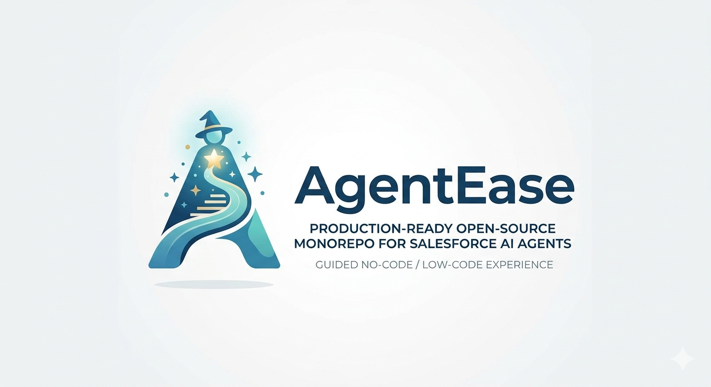

<div align="center">
  
</div>

## Why AgentEase

AgentEase is a production-ready open-source monorepo for building, testing, and deploying Salesforce AI agents through a guided no-code / low-code experience.
It is designed for non-technical users first: consultants, admins, CX teams, and operations teams who need Agentforce DX power without CLI complexity.
Salesforce Agentforce DX is powerful, but CLI-driven workflows are hard to operationalize across mixed-skill teams.
AgentEase adds:

- A **wizard-based builder** for agent creation.
- A **chat playground** for safe simulation.
- A **deployment workflow with logs**.
- **OAuth-based multi-org connectivity**.
- A strict backend architecture that supports long-term scale.

## Architecture Overview

This repository uses **Turborepo** and strict layered backend design.

### Monorepo Layout

```txt
apps/
  web/        Next.js App Router app (no-code UX)
  desktop/    Electron wrapper for local CLI + filesystem use
  api/        Express + Prisma backend

packages/
  ui/          Shared UI primitives
  types/       Shared strict TypeScript contracts
  agent-engine/ Agent config validation/build logic
  salesforce/  OAuth and token vault abstractions
  cli-wrapper/ Agentforce DX CLI integration via spawn
```

### Backend Layering (apps/api)

Each module follows:

- `controller.ts` → HTTP transport only
- `service.ts` → business logic
- `repository.ts` → persistence layer
- `types.ts` → module contracts

Modules included:

- `agent`
- `auth`
- `deployment`
- `org`

### Key API Endpoints

| Method | Path | Description |
|--------|------|-------------|
| `GET` | `/api/agents` | List all agents |
| `POST` | `/api/agents` | Create an agent |
| `GET` | `/api/agents/:id` | Get agent details + deployments |
| `GET` | `/api/orgs` | List connected Salesforce orgs |
| `POST` | `/api/orgs` | Connect a new Salesforce org |
| `GET` | `/api/deployments?agentId=` | List deployments |
| `POST` | `/api/deploy` | Trigger a deployment |
| `GET` | `/health` | Health check |

## Core Product Flows

### 1) Create Agent (Guided wizard)
Users progress through a 3-step wizard with contextual help, best-practice tips, and Salesforce-specific guidance at every step:
1. **Name** — action-oriented name suggestions (e.g. "Case Deflector", "Lead Qualifier")
2. **Description** — guidance on describing the business outcome
3. **Prompt Template** — 5 pre-built Salesforce templates to choose from (Case Deflection, Lead Qualification, Order Status, Knowledge Search, IT Helpdesk) or write your own

### 2) Test in Playground
Users simulate interactions with their agent in a chat interface before deploying:
- Clickable suggested prompts to try common scenarios quickly
- Clear conversation button to reset
- Simulated agent responses (real Agentforce calls in future releases)

### 3) Deploy to Salesforce
Deployment calls the Agentforce DX CLI via the CLI wrapper, streams logs back to the UI, and stores deployment records in the database.

### 4) Onboarding Checklist
First-time users see a step-by-step "Get started in 4 steps" checklist on the dashboard guiding them through: Connect Org → Create Agent → Test → Deploy.

## CLI Wrapper (packages/cli-wrapper)

`AgentforceService` exposes:

- `createAgent(config)`
- `previewAgent(config)`
- `deployAgent(config, org)`

Implementation highlights:

- Uses `child_process.spawn` (not `exec`)
- Captures stdout/stderr streams
- Parses JSON log lines into structured metadata
- Returns a strict result shape:

```ts
{
  success: boolean;
  logs: string[];
  errors: string[];
  metadata?: Record<string, unknown>;
}
```

## Database

Prisma + embedded SQLite models:

- `User`
- `Agent`
- `SalesforceOrg`
- `Deployment`

Schema: `apps/api/prisma/schema.prisma`

## Environment Setup

Copy and configure:

```bash
cp .env.example .env
```

| Variable | Description | Example |
|----------|-------------|----------|
| `DATABASE_URL` | SQLite DB path (relative to `apps/api/`) | `file:./prisma/agentease.db` |
| `API_PORT` | Express API port | `4000` |
| `WEB_APP_URL` | URL the Electron app loads | `http://localhost:3150` |
| `NEXT_PUBLIC_API_URL` | API URL used by the Next.js frontend | `http://localhost:4000` |
| `JWT_SECRET` | Secret for signing JWT tokens | Replace with a long random string |
| `SALESFORCE_CLIENT_ID` | Connected App consumer key | From Salesforce Setup → App Manager |
| `SALESFORCE_CLIENT_SECRET` | Connected App consumer secret | From Salesforce Setup → App Manager |
| `SALESFORCE_REDIRECT_URI` | OAuth callback URL | `http://localhost:4000/api/auth/callback` |
| `SALESFORCE_LOGIN_URL` | Salesforce login URL | `https://login.salesforce.com` |
| `AGENTFORCE_CLI_BIN` | Agentforce CLI binary name | `sf` |

> **Note:** The SQLite database is created automatically on first run — you don't need to set it up manually.

## Local Development

### Prerequisites

- Node.js 18+
- [Salesforce CLI (`sf`)](https://developer.salesforce.com/tools/salesforcecli) installed and authenticated

### Start everything

```bash
npm install
cp .env.example .env   # then edit .env with your values
npm run dev
```

`npm run dev` starts all three apps in parallel via Turborepo:

| App | URL | Description |
|-----|-----|-------------|
| **web** | http://localhost:3150 | Next.js no-code UI |
| **api** | http://localhost:4000 | Express + Prisma backend |
| **desktop** | — | Electron wrapper (auto-opens after web is ready) |

The SQLite database is automatically created at `apps/api/prisma/agentease.db` on first start.

### Run API tests only

```bash
npm --workspace @agentease/api test
```

## Non-Technical UX Design Principles

AgentEase is built for Salesforce admins, consultants, and CX teams — not just developers:

- **Guided wizard** with contextual tips and best-practice advice at every step.
- **Clickable name suggestions** so users don't start from a blank page.
- **Pre-built prompt templates** for the most common Salesforce agent use cases.
- **Onboarding checklist** on the dashboard that walks first-time users through the full flow.
- **Suggested prompts** in the playground so users know what to test.
- **Progressive disclosure** — complexity is hidden until it's needed.
- **Human-readable deployment logs** — no raw JSON or CLI output exposed.
- **Clear task-oriented navigation** — Dashboard, Agents, Playground.
- **Safe simulation before production deploy** — test first, ship with confidence.

## Security Notes

- OAuth token storage uses an **encrypted placeholder vault** abstraction by default.
- Replace placeholder vault implementation with KMS/HSM-backed encryption in production.
- Keep all secrets in environment variables.

## License

MIT © 2026 AgentEase
